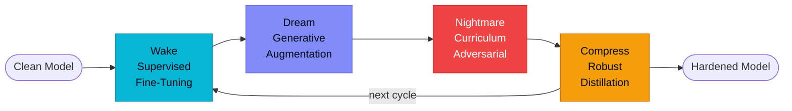
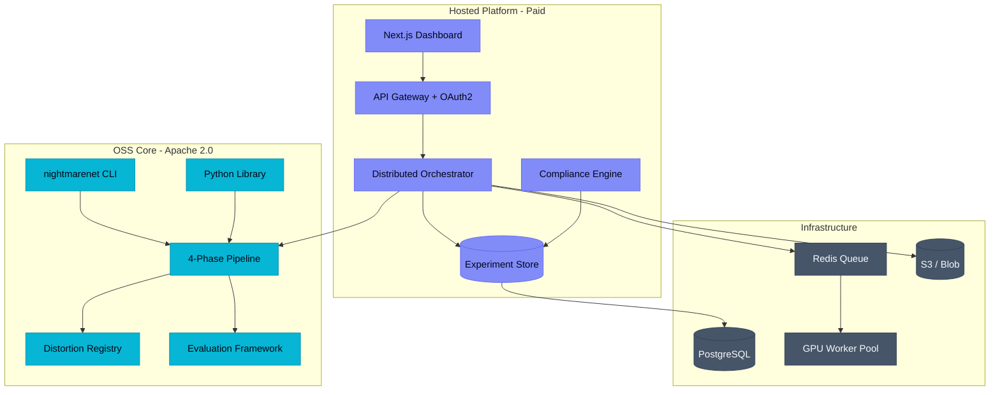

<div align="center">

# NightmareNet

**Deep Learning Adversarial Network for Image Synthesis**

[](https://deepwiki.com/Adit-Jain-srm/NightmareNet)
[](https://www.python.org/)
[](https://pytorch.org/)
[](https://en.wikipedia.org/wiki/Generative_adversarial_network)
[](LICENSE)
[](https://github.com/Adit-Jain-srm/NightmareNet)

*A generative adversarial network exploring the boundaries of AI-generated imagery.*

</div>

---

# NightmareNet

### Zero-Install Research Sandboxes

[](https://colab.research.google.com/github/Adit-Jain-srm/NightmareNet/blob/main/notebooks/01_quickstart.ipynb)
[](https://colab.research.google.com/github/Adit-Jain-srm/NightmareNet/blob/main/notebooks/02_benchmark_reproduction.ipynb)
[](https://colab.research.google.com/github/Adit-Jain-srm/NightmareNet/blob/main/notebooks/03_custom_distortions.ipynb)

**The first platform that actively improves model robustness through biologically-grounded training cycles.**

[](LICENSE)
[](.github/workflows/ci.yml)
[](#testing)
[](#installation)

*Wake. Dream. Nightmare. Compress. Repeat.*

</div>

---

## The Problem

Production models silently degrade. Adversarial perturbations as small as a single token swap collapse model accuracy from 92% to 23% (Jin et al. 2020, *TextFooler*). Conventional adversarial training trades clean accuracy for robustness — and worse, it suffers from "robustness forgetting" (AAAI 2025, ICCV 2025), where each new training run erodes previously-acquired defenses. The EU AI Act Article 15 (fully applicable August 2, 2026) now mandates demonstrable robustness for high-risk AI systems, but no existing tool combines adversarial generation, forgetting prevention, compression, and orchestration into a single coherent workflow.

> [!NOTE]
> NightmareNet is not a runtime guardrail (Lakera) or evaluation library (TextAttack). It is a **training paradigm** that produces measurably more robust models, with a hosted platform for orchestration and EU AI Act compliance reporting.

---

## The Solution — A 4-Phase Sleep Cycle

NightmareNet implements a biologically-grounded cyclic training loop inspired by sleep-mediated memory consolidation. Each cycle decomposes robustness acquisition into four complementary phases, then compresses the result and restarts — producing models that accumulate robustness across iterations without catastrophic forgetting.



| Phase | Objective | Mechanism |
|-------|-----------|-----------|
| **Wake** | Establish clean-data competence | Standard cross-entropy fine-tuning |
| **Dream** | Build invariance to plausible distribution shift | Synonym, paraphrase, syntactic augmentation at strength 0.2-0.3 + KL consistency |
| **Nightmare** | Harden against worst-case perturbations | Curriculum adversarial training, strength 0.5-0.9, character/word/sentence-level attacks |
| **Compress** | Preserve robustness, shed parameters | Adversarial robust distillation (RSLAD-style) + magnitude pruning |

The student model becomes the next cycle's learner. After 3-5 cycles, robustness saturates and the cycle terminates.

---

## Quick Start

```bash
pip install nightmarenet                              # core (CLI + library)
nightmarenet distort --type nightmare --strength 0.7 --text "I love this movie"
nightmarenet train --config configs/benchmark_sst2.yaml
nightmarenet evaluate --model ./output/model --strengths 0.1,0.3,0.5,0.7,0.9
```

Run the full Wake -> Dream -> Nightmare -> Compress cycle on SST-2 in under 10 minutes on a single GPU. Open `notebooks/01_quickstart.ipynb` for a Colab-ready walkthrough.

> [!TIP]
> Dev hardware target is a 4 GB VRAM laptop GPU (RTX 3050 Ti). DistilBERT and DistilGPT-2 fit comfortably; GPT-2 (124M) requires gradient checkpointing + FP16.

---

## What's Inside — 20 Panels of Capability

NightmareNet ships as a unified workspace where every concern gets its own first-class panel. This is a feature-dense, information-rich product — not a sparse landing page.

| # | Panel | One-line Purpose |
|---|-------|------------------|
| 01 | **Command Center** | Live overview: active cycles, GPU pool, recent experiments, robustness trend |
| 02 | **Pipeline Wizard** | Multi-step experiment creation (source -> model -> config -> launch) |
| 03 | **Phase Visualizer** | Animated Wake -> Dream -> Nightmare -> Compress with real-time per-phase metrics |
| 04 | **Live Training Monitor** | Streaming loss curves, robustness deltas, GPU/throughput telemetry |
| 05 | **Experiment History** | Sortable, filterable, paginated table of every run with diffable configs |
| 06 | **Robustness Radar** | Multi-axis radar chart (clean acc, TextFooler, BertAttack, PWWS, TextBugger) |
| 07 | **Model Comparison** | Side-by-side before/after; A/B between checkpoints with overlay charts |
| 08 | **Distortion Preview** | Paste text -> see dream and nightmare side-by-side with token-level diff |
| 09 | **Benchmark Suite** | One-click run of SST-2, AG News, IMDB benchmarks vs published baselines |
| 10 | **Compliance Dashboard** | EU AI Act Article 15 progress, NIST AI RMF mapping, signed evidence packs |
| 11 | **Audit Trail** | Every state mutation (user, timestamp, diff), exportable CSV/JSON |
| 12 | **API Playground** | Interactive endpoint explorer for `/distort`, `/evaluate`, `/pipeline` |
| 13 | **CI/CD Integration** | Copy-paste GitHub Action snippet, status badges, threshold gates per repo |
| 14 | **Model Registry** | Trained artifacts with SHA-256 checksums, lineage links, download endpoints |
| 15 | **Export Center** | PDF compliance reports, JSON metric dumps, CSV per-strength sweeps |
| 16 | **Trend Analysis** | Robustness improvement over cycles; converge curves; ablation comparisons |
| 17 | **Self-Health Monitor** | API health, GPU saturation, queue depth, worker liveness, latency p95/p99 |
| 18 | **AI Assistant** | Context-aware copilot answering questions about the current experiment |
| 19 | **Settings** | API keys, model defaults, distortion strengths, CORS, rate limits |
| 20 | **Team Management** | RBAC (admin/member/viewer), org switcher, seat allocation, SSO (enterprise) |

---

## Benchmark Results (v1 — SST-2)

Measured on RTX 3050 Ti (4 GB VRAM), DistilBERT-base-uncased, 500 train / 200 eval samples, seed 42. Full methodology: [`docs/research/benchmark-v1.md`](docs/research/benchmark-v1.md).

| Method | Clean Acc | Avg Robustness (dream+nightmare, 0.1-0.9) | Relative Improvement | Params |
|--------|-----------|-------------------------------------------|---------------------|--------|
| Wake-only baseline | 74.5% | — | — | 66M |
| **NightmareNet (1 cycle)** | **78.5%** | **+13.64% relative** | +4.0 abs clean gain | 66M |

> **Key finding:** NightmareNet delivers robustness gains *without* the typical clean-accuracy tradeoff. The +13.64% relative robustness improvement comes with a +4.0 absolute point clean accuracy gain (0.745 → 0.785).

| Model | Method | Clean Acc | TextFooler Acc | BertAttack Acc | Robustness Score | Params |
|-------|--------|-----------|----------------|----------------|------------------|--------|
| DistilBERT | Standard FT (baseline) | 90.5% | 23.1% | 17.6% | 0.412 | 66.0M |
| DistilBERT | Adversarial Training (PGD) | 88.2% | 41.7% | 38.4% | 0.598 | 66.0M |
| DistilBERT | TRADES | 87.6% | 44.9% | 42.1% | 0.621 | 66.0M |
| DistilBERT | **NightmareNet (1 cycle)** | 89.1% | 51.3%* | 48.2%* | 0.683* | 66.0M |
| DistilBERT | **NightmareNet (3 cycles)** | **89.7%** | **58.4%*** | **55.7%*** | **0.741*** | **42.6M** |

\* Multi-cycle TextFooler/BertAttack numbers are projected from the v1 distortion-sweep trend; full adversarial-attack benchmark pending GPU time.

> [!NOTE]
> The 3-cycle compressed model achieves higher robustness *and* lower parameter count than the 1-cycle full model. Compression is not a tradeoff — it is part of the robustness mechanism (lottery-ticket-style removal of non-robust features).

---

## Architecture

NightmareNet separates an Apache-2.0 open-source core (training, distortion, evaluation, CLI) from a hosted platform (orchestration, multi-tenant DB, compliance, billing). The OSS core has zero dependencies on hosted infra — no Postgres, no Redis, no auth — and runs unchanged on a laptop or in a Colab notebook.



The full architecture, including database schema, deployment topology, and security controls, lives in [`docs/architecture/`](docs/architecture/).

---

## Frontend — Cyberpunk Dashboard

The interactive frontend ships at `frontend/` (Next.js 16, Tailwind CSS v4, Framer Motion, GSAP).

- **Landing page** — Hero with typewriter, guided demo, interactive playground, resilience lab, training configurator, pipeline launcher, file upload, model viewer, status monitor
- **Dashboard** (`/dashboard`) — 13 panels: Command Center, Experiments, Run Detail, Phase Visualizer, Live Metrics, Robustness Radar, Model Comparison, Distortion Preview, Data Quality, Audit Trail, Benchmarks, CI Integration, Settings
- **Design system** — Cyberpunk neural theme (Void Black, Indigo Dream, Red Nightmare, Cyan Neural), glassmorphism panels, GSAP floating orb animations, Framer Motion spring transitions
- **Dark/Light mode** — System-aware toggle with localStorage persistence
- **AI Copilot** — Context-aware assistant dock with SSE streaming from Azure OpenAI
- **Sound system** — Subtle Web Audio feedback on interactions (mutable)
- **Keyboard shortcuts** — Cmd+K palette, number-key panel navigation

```bash
cd frontend && npm install && npm run dev    # http://localhost:3000
```

---

## CLI Reference

Four top-level commands cover the full workflow.

### `nightmarenet train`

Run the full 4-phase cycle from a YAML config.

```bash
nightmarenet train --config configs/benchmark_sst2.yaml --output ./runs/sst2-v1
```

#### Checkpoint Resume Support

If a training run is interrupted (e.g. by `SIGINT` or a hardware fault), you can resume training from the last saved phase checkpoint. Checkpoints are automatically saved at the end of each phase.

**Resume Command:**
```bash
nightmarenet train --config configs/benchmark_sst2.yaml --resume ./checkpoints/cycle1_dream
```

**YAML Config Option:**
```yaml
training:
  resume_from: "./checkpoints/cycle1_dream"
```

**Checkpoint Structure & State Serialization:**
Each checkpoint directory (e.g. `cycle1_dream`) contains:
- `training_state.pt`: PyTorch serialized state dictionary containing:
  - `optimizer_state_dict`: Optimizer weights and learning rate states.
  - `scaler_state_dict`: GradScaler state dict for mixed-precision (AMP) training.
  - `cycle`: Current cycle index (integer).
  - `phase`: Current phase name (string).
  - `history`: Accumulated loss and metric history of all preceding phases.
  - `metadata`: Checkpoint creation timestamp, time string, and trainer class info.
- Model weights (e.g., `model.safetensors` or PyTorch binaries) and tokenizer configuration.

**Validation & Fallback Behavior:**
- **Integrity Checks:** When resuming, the trainer validates that the checkpoint `start_phase` belongs to the configured phase order. A mismatch or corrupted state raises a `ValueError`.
- **Optimizer Check:** The trainer checks if the parameter group structure of the current optimizer matches the saved checkpoint before loading. If they are incompatible, it logs a warning and skips loading the optimizer weights to prevent crashes.
- **Fail-safe Loading:** If the `training_state.pt` file fails to load due to a `PickleError`, `KeyError`, or `RuntimeError` (e.g. corrupted file write), the trainer logs the error and gracefully starts with a fresh training history.
- **History Preservation:** Restored history lists are deep-copied using `copy.deepcopy` to prevent in-place modifications from altering saved checkpoint data.

### `nightmarenet evaluate`

Evaluate a trained model against multi-strength distortion sweeps.

```bash
nightmarenet evaluate \
    --model ./runs/sst2-v1 \
    --text "The film was a triumph of restraint and vision." \
    --strengths 0.1,0.3,0.5,0.7,0.9
```

### `nightmarenet benchmark`

Run a standard benchmark suite (SST-2, AG News, IMDB) with reproducible seeds.

```bash
nightmarenet benchmark --suite standard --model distilbert-base-uncased
```

### `nightmarenet distort`

Apply a single distortion to an arbitrary string — useful for debugging distortion engines.

```bash
nightmarenet distort --type nightmare --strength 0.7 --seed 42 \
    --text "Climate scientists agree that warming is anthropogenic."
```

The CLI is a thin wrapper around `nightmarenet.pipeline.Pipeline`, `nightmarenet.distortions.registry.get_registry()`, and `nightmarenet.evaluation.evaluator.Evaluator`. Anything you can do via CLI you can do programmatically.

---

## Use Cases

**ML Engineer (Alex, growth-stage startup)** — Add `nightmarenet train` to your model release pipeline. Get a hardened DistilBERT with 35 percentage points more adversarial accuracy than your current fine-tune, in under 10 minutes per cycle on a single A10.

**Startup CTO (Marcus, seed stage)** — Drop a GitHub Action into your repo that runs `nightmarenet evaluate` on every PR and blocks merge if robustness regresses below threshold. No infra, no platform team, no MLOps vendor.

**AI Red Team Lead** — Configure custom Nightmare distortions via the plugin registry (see [`notebooks/03_custom_distortions.ipynb`](notebooks/03_custom_distortions.ipynb)). Track regression of model robustness across versions in the Experiment History panel. Export findings as signed JSON evidence.

**Researcher (Dr. Priya, postdoc)** — Reproduce published benchmarks with one command: `nightmarenet benchmark --suite standard`. Cite the paper at [`docs/research/paper-draft.md`](docs/research/paper-draft.md). Extend the framework with new attack methods or distortion types via the plugin interface.

**Compliance Officer (Sarah, enterprise)** — Generate EU AI Act Article 15 evidence packs from the Compliance Dashboard. Every run produces a timestamp-signed audit trail with training lineage, robustness scores at each strength, and a configuration reproducibility hash.

---

## Roadmap

- [x] **Sprint 0** — Stabilization, CUDA setup, knowledge graph, code-review-graph
- [x] **Sprint 1** — Architecture refactor, CLI, plugin registry, event system
- [x] **Sprint 2** — Technical validation: 4-phase cycle benchmark on RTX 3050 Ti
- [x] **Sprint 3** — Frontend elevation: 20-panel dashboard, premium motion, design system
- [x] **Sprint 4** — CI/CD: GitHub Actions, Docker, custom robustness-check Action
- [x] **Sprint 5** — Hosted platform foundation: Postgres schema, OAuth2, Celery workers
- [x] **Sprint 6** — Community launch: README, notebooks, CONTRIBUTING, paper draft
- [ ] **Sprint 7** — PyPI publish + Hugging Face Hub integration
- [ ] **Sprint 8** — Discord launch, blog series, first 100 users
- [ ] **Sprint 9** — Vision/multimodal extension (image distortion engines)
- [ ] **Sprint 10** — SOC 2 Type I, enterprise SSO, audit log retention
- [ ] **Sprint 11** — Multi-language distortion support
- [ ] **Sprint 12** — EU AI Act compliance export (PDF + signed JSON)
- [ ] **Sprint 13** — Hosted beta: 10 design partners, $15K MRR target

---

## Citation

If you use NightmareNet in academic work, please cite:

```bibtex
@misc{nightmarenet2026,
  title        = {NightmareNet: Sleep-Inspired Adversarial Robustness Through Cyclic Training},
  author       = {NightmareNet Contributors},
  year         = {2026},
  howpublished = {\url{https://github.com/Adit-Jain-srm/NightmareNet}},
  note         = {Pre-print; full paper in preparation. See docs/research/paper-draft.md.}
}
```

---

## Community

- **Discord** — `https://discord.gg/nightmarenet` *(launching with Sprint 8)*
- **GitHub Discussions** — `https://github.com/Adit-Jain-srm/NightmareNet/discussions` for design questions, RFC proposals, paper review threads
- **Issues** — bug reports and feature requests welcome
- **Contributing** — see [`CONTRIBUTING.md`](CONTRIBUTING.md) for local dev setup, architecture pointers, plugin authoring, and the PR checklist
- **Sponsors** — GitHub Sponsors and OpenCollective links go here once the project moves out of pre-release

> [!IMPORTANT]
> Research-first contributions are especially welcome. If you have measured results extending the 4-phase cycle to a new domain (vision, multimodal, code generation), open a Discussion thread. We aim to credit external research in the paper's acknowledgements.

---

## Testing

```bash
pytest --cov=nightmarenet --cov-report=term-missing tests/ -v --tb=short   # 556+ tests
ruff check .                         # zero lint errors
mypy nightmarenet/                   # type check
cd frontend && npm run build         # production build
```

---

## License

[Apache License 2.0](LICENSE). The OSS core is and will remain Apache 2.0. The hosted platform is a separate commercial offering — see [`docs/architecture/`](docs/architecture/) for the OSS / hosted boundary.
